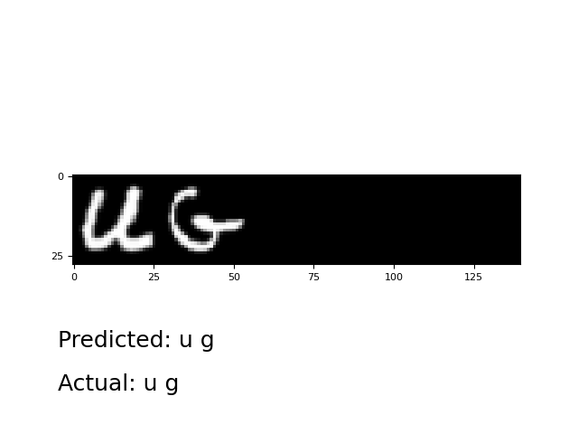
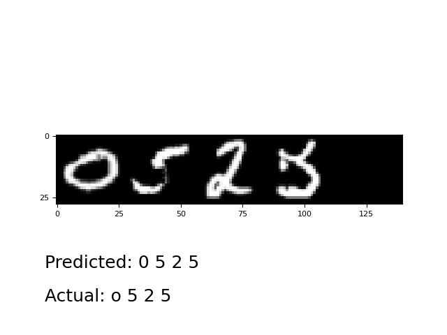
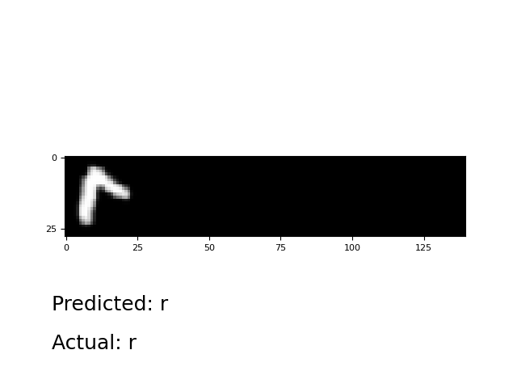
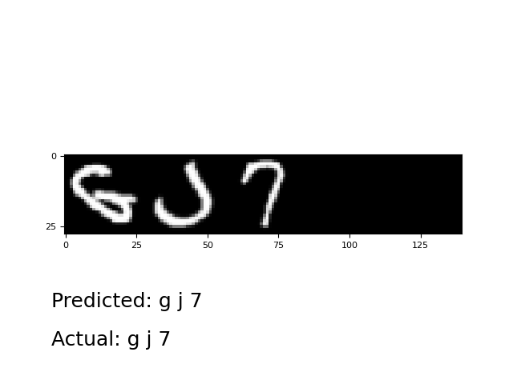
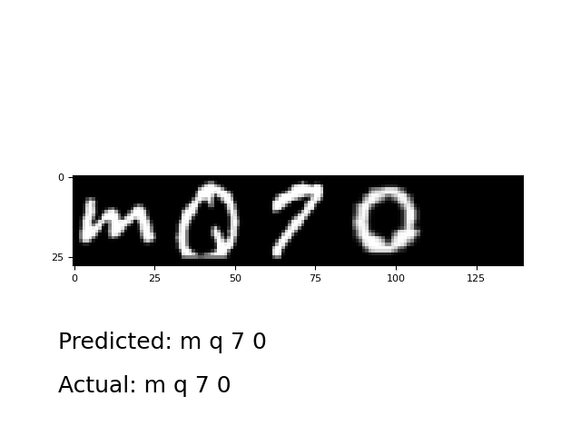
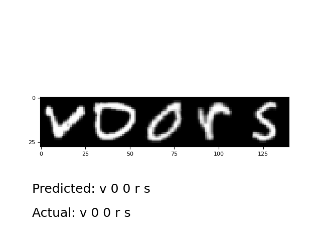
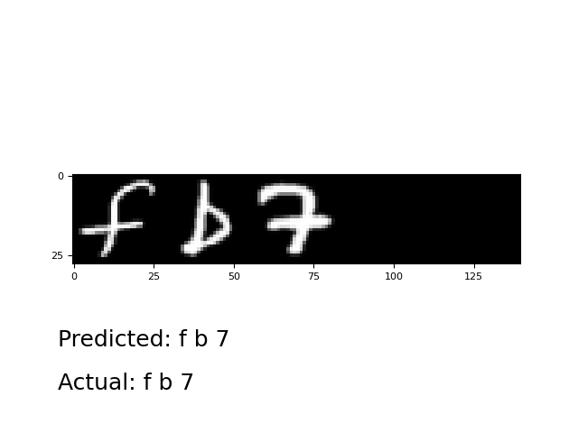
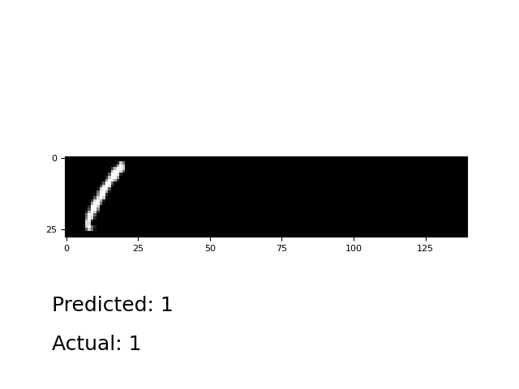
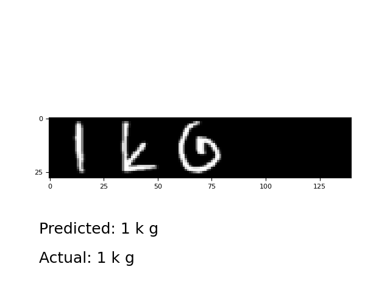
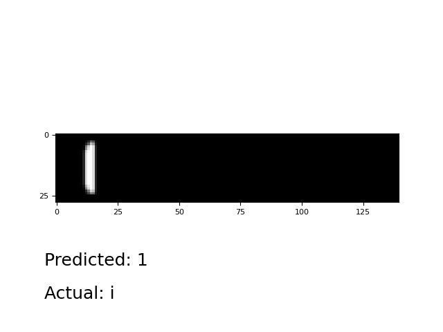

## Пример OCR с использованием CTC Loss

### Описание
Датасет - комбинация EMNIST (digits) и EMNIST (letters)\
Функция потерь - CTC Loss\
Метрика качества - accuracy

Для тестирования реализован алгоритм beam search при помощи ctc_decoder из torchaudio

### Результаты
Длина последовательности символов в одном экземпляре: 1-5\
Число эпох для обучения: 70\
Размер выборки обучающей на эпоху: 1 024 000\
Размер валидационной выборки на эпоху: 10 000
Batch size: 1024

Accuracy: 0.89

<details><summary>Примеры работы</summary>












</details>

### Запуск проекта
1. Выполнить сборку образа
```
docker build -t ocr .
```
2. Внутри контейнера запустить обучение
```
python train.py
```

### Исходный проект
* https://github.com/dredwardhyde/crnn-ctc-loss-pytorch